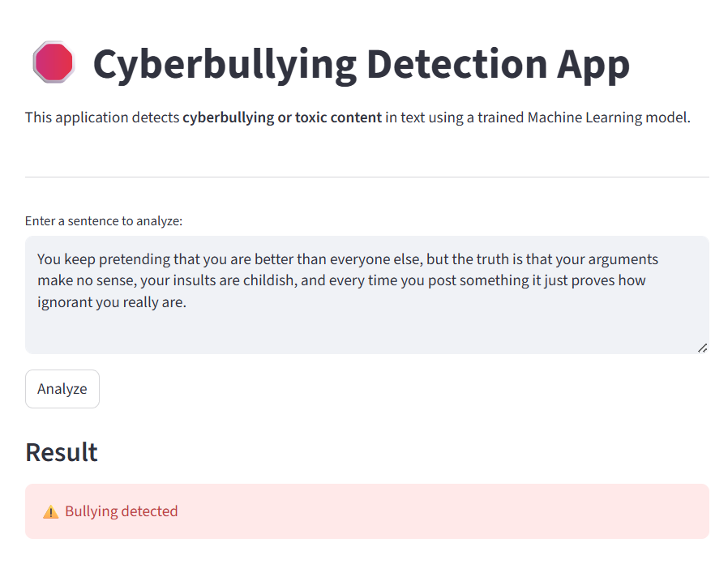

# Cyberbullying Detection using Machine Learning

## Overview

This project builds a **machine learning system to detect cyberbullying in text content**.
The model classifies input sentences as either:

* **Bullying (1)**
* **Non-bullying (0)**

The pipeline includes:

* Data cleaning and preprocessing
* Negation-aware text processing
* TF-IDF feature extraction
* Training multiple machine learning models
* Selecting the best model based on performance
* Saving the trained model for future inference

The final system achieves **~92% classification accuracy** using a fast linear classifier.

Sample of the application to detect cyberbully:

---

# Dataset

The dataset contains **18,148 text samples** with two columns:

| Column     | Description                                   |
| ---------- | --------------------------------------------- |
| `headline` | Text content                                  |
| `label`    | Class label (-1 = bullying, 0 = non-bullying) |

Example:

| headline                                    | label |
| ------------------------------------------- | ----- |
| cock suck before you piss around on my work | -1    |
| you are gay or antisemmitian                | -1    |
| fuck your filthy mother                     | -1    |

## Data Cleaning

Steps performed:

* Removed **1079 duplicate rows**
* Converted labels:

  * **-1 → 1 (bullying)**
  * **0 → 0 (non-bullying)**

Final dataset size:

```
17069 samples
```

Class distribution:

| Class        | Count |
| ------------ | ----- |
| Bullying     | 10588 |
| Non-bullying | 6481  |

---

# Text Preprocessing

The project includes a **custom NLP preprocessing pipeline** designed for toxic language detection.

## Steps

1. Remove HTML tags
2. Expand contractions
   Example:

```
don't → do not
```

3. Remove emojis
4. Remove URLs
5. Convert to lowercase
6. Remove punctuation and special characters
7. Apply **negation tagging**
8. Remove stopwords
9. Lemmatize words

---

# Negation Handling

A major challenge in cyberbullying detection is **negation context**.

Example:

```
"I hate you" → bullying
"I do not hate you" → non-bullying
```

To preserve meaning, the system applies **negation tagging**.

Example transformation:

```
"I do not hate you"
↓
"not NOT_hate"
```

Another example:

```
"I don't think you're stupid"
↓
"not NOT_think NOT_stupid"
```

This allows the model to distinguish between **negative sentiment and negated insults**.

---

# Feature Engineering

Text is converted into numerical features using **TF-IDF vectorization**.

Configuration:

```
max_features = 5000
ngram_range = (1,2)
min_df = 2
```

This captures:

* Unigrams → `hate`
* Bigrams → `NOT_hate`

Feature matrix size:

```
(13655, 5000)
```

---

# Model Training

Five machine learning models were compared:

* Logistic Regression
* Linear SVM
* Multinomial Naive Bayes
* SGD Classifier
* XGBoost

Evaluation metrics:

* **F1 Score**
* Precision
* Recall
* Training Time
* Prediction Time

---

# Model Performance

| Model               | F1 Score  | Precision | Recall | Train Time | Prediction Time |
| ------------------- | --------- | --------- | ------ | ---------- | --------------- |
| **SGD**             | **0.918** | 0.919     | 0.918  | 0.08s      | 0.001s          |
| Logistic Regression | 0.914     | 0.915     | 0.914  | 0.24s      | 0.004s          |
| XGBoost             | 0.914     | 0.917     | 0.913  | 7.86s      | 0.029s          |
| LinearSVC           | 0.910     | 0.910     | 0.909  | 0.07s      | 0.001s          |
| MultinomialNB       | 0.875     | 0.875     | 0.876  | 0.007s     | 0.002s          |

---

# Final Model

The **SGDClassifier** was selected because it:

* Achieves the **highest F1 score**
* Has **very fast training**
* Has **extremely fast prediction**
* Works well with **sparse TF-IDF features**

Final classification report:

```
Accuracy: 92%
Macro F1: 0.91
Weighted F1: 0.92
```

---

# Model Saving

The trained model and vectorizer are saved using `joblib`.

```
model.pkl
vectorizer.pkl
```

---

# Running Inference

Example usage:

```python
import joblib

model = joblib.load("model.pkl")
vectorizer = joblib.load("vectorizer.pkl")

text = "Nobody likes you"

processed = preprocess_text(text)
X = vectorizer.transform([processed])

prediction = model.predict(X)[0]

if prediction == 1:
    print("Bullying detected")
else:
    print("Non-bullying content")
```

---

# Example Predictions

| Sentence                   | Prediction   |
| -------------------------- | ------------ |
| Nobody likes you           | Bullying     |
| Don't be so mean to people | Non-bullying |
| You're so stupid and ugly  | Bullying     |
| I don't like you           | Non-bullying |
| fuck off you piece of shit | Bullying     |

---

# Project Structure

```
cyberbullying-detection/
│
├── dataset.csv
├── model.pkl
├── vectorizer.pkl
├── train_model.ipynb
└── README.md
```

---

# Technologies Used

* Python
* pandas
* scikit-learn
* NLTK
* BeautifulSoup
* XGBoost
* joblib

---

# Future Improvements

Possible improvements include:

* Transformer models (BERT / RoBERTa)
* Larger cyberbullying datasets
* Context-aware moderation
* Multilingual toxicity detection
* Real-time API deployment

---

# Conclusion

This project demonstrates a **complete NLP pipeline for cyberbullying detection**, including:

* advanced text preprocessing
* negation handling
* TF-IDF feature engineering
* machine learning model comparison
* efficient model deployment

The final system provides **accurate and fast detection suitable for real-time applications**.
